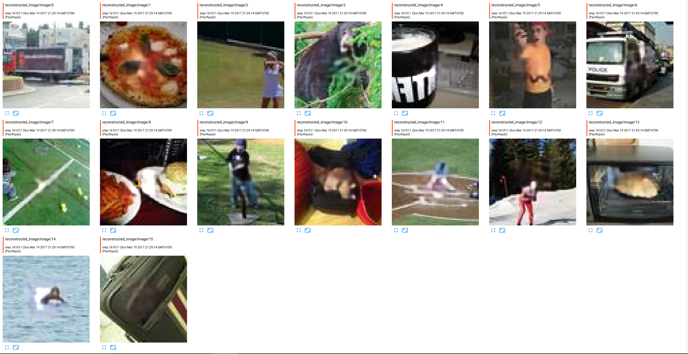
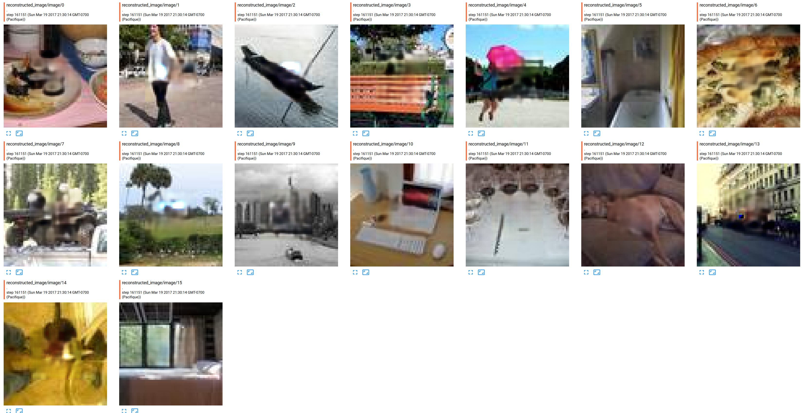
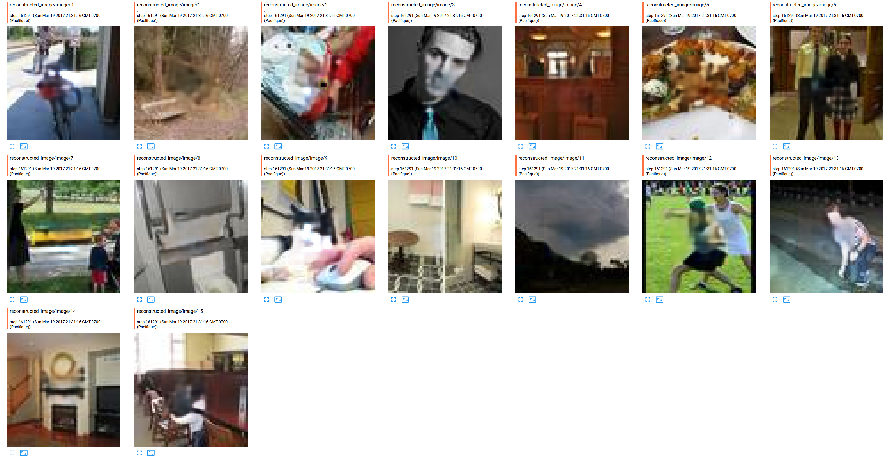
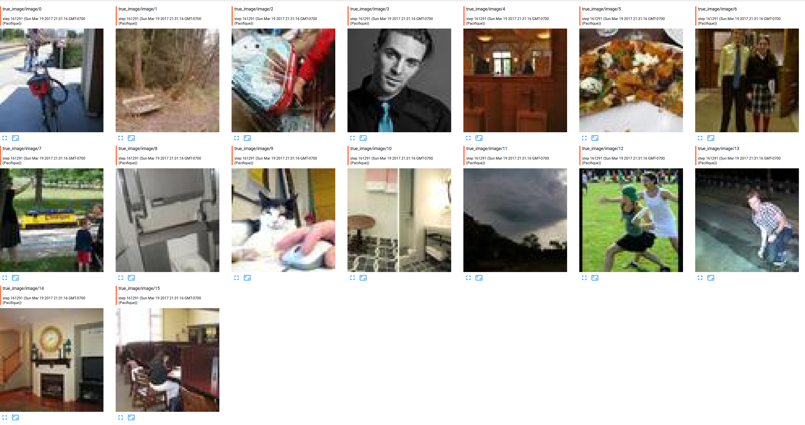
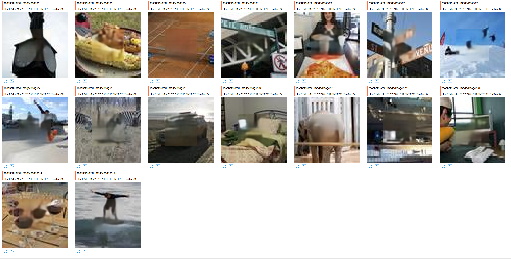
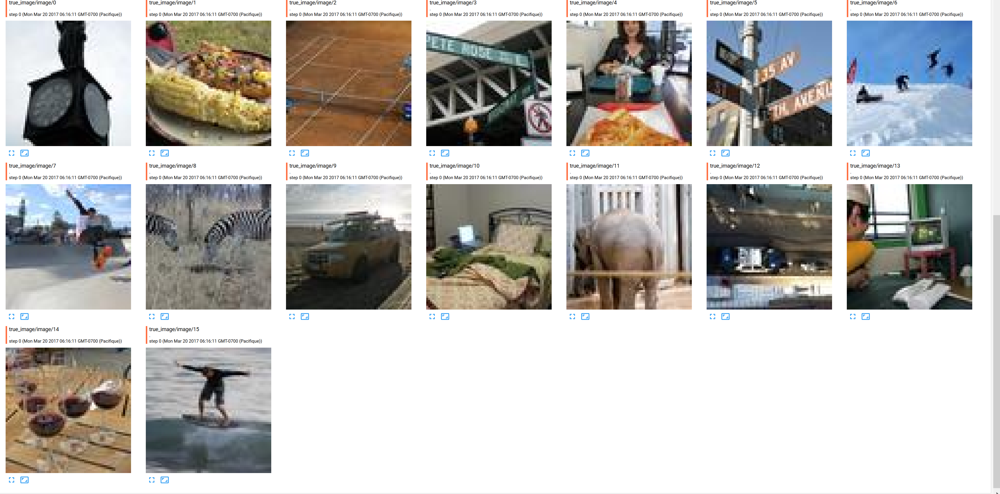
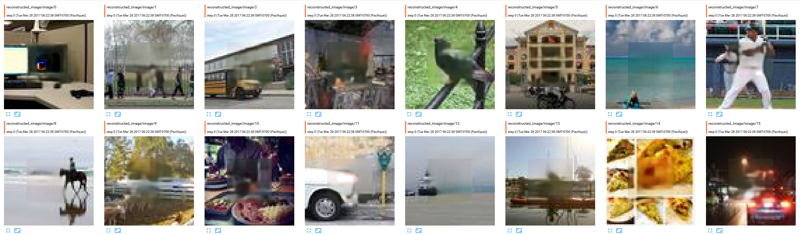
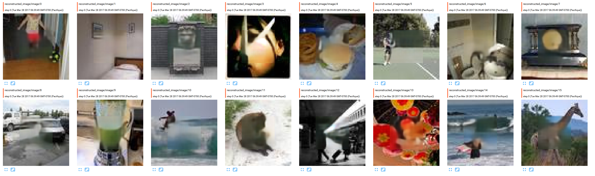
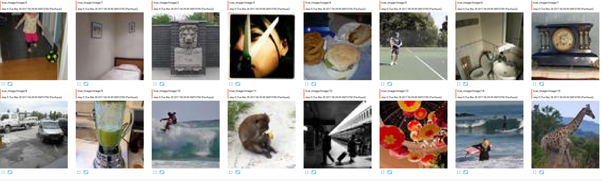

# State of my art results:
## Training set

  
and the true image, to see the difference
  

## Testing set:
* Generated image: 
  
* True image:
  

* Generated image:
  
  
* True image:
 

# What worked for me (and what didn't)
_See Thoughts.md_

# RoadMap
- [X] Finish generating embeddings
- [X] Reduce learning rate before overfitting
- [X] Add decaying dropout to the training
- [ ] Is DRAW outdated based on GAN recent results... DRAW architecture were every iteration is condition on previous generated images + new caption?
- [X] Better data augmentation
- [ ] Make GAN works, whether WGAN or classical ones
- [ ] Refactor the code
- [X] Try to generate "HD" images, like in StackGAN (need to retrieve from MS-COCO for supervised learning)
- [ ] Used ideas from there: 
