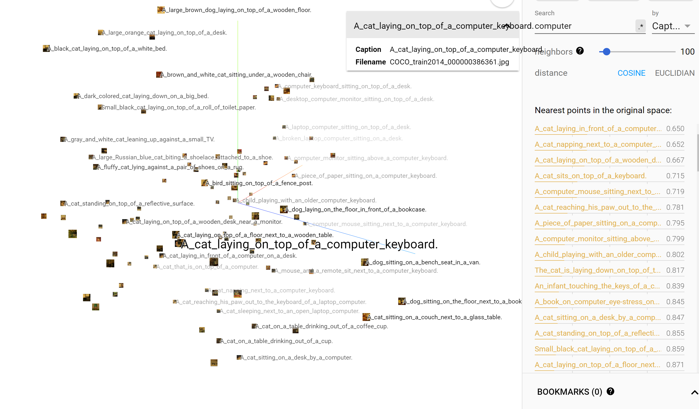
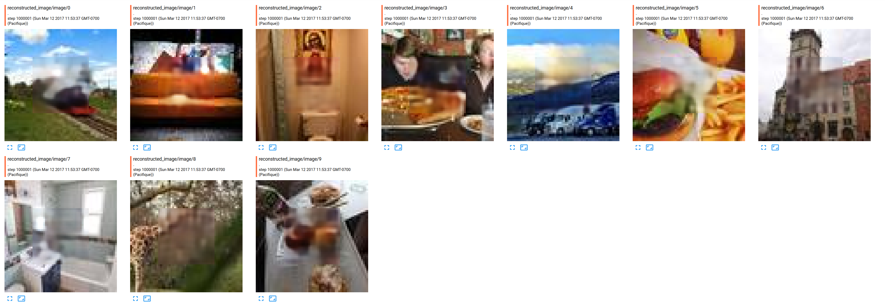
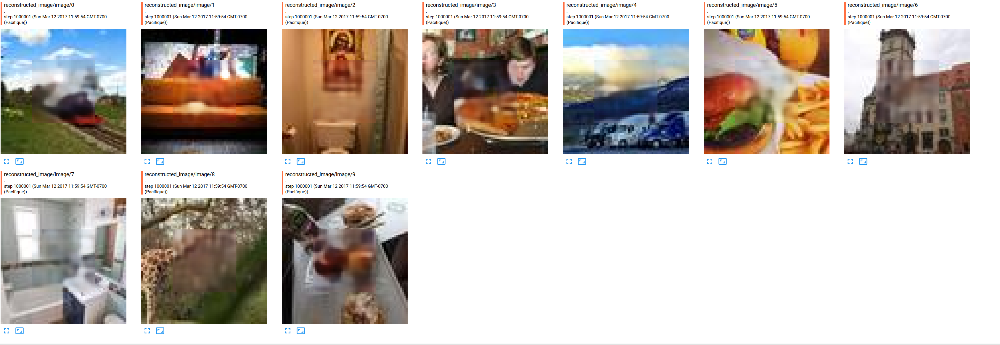
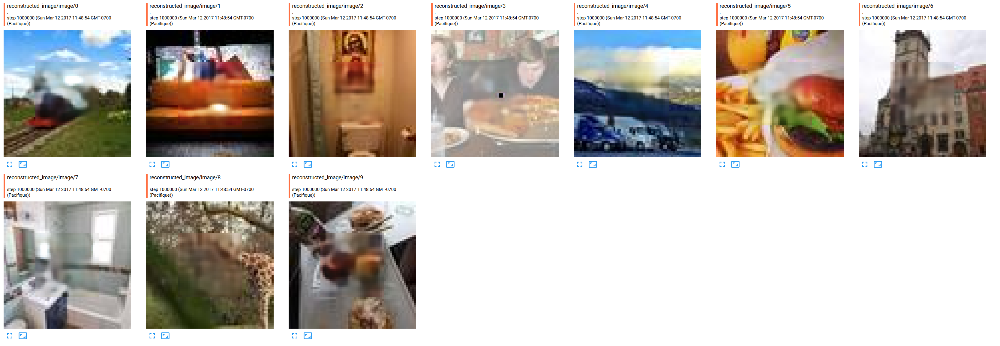
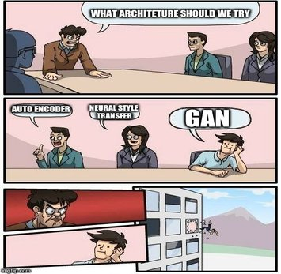

First of all, I am not in the course officially, so I am doing this project for pur fun.  
# Captions
There has been some incredible results recently for filling images, but none of them were using captions. This is why I focus mainly on trying to introduce captions in recent similar model.  

I've been spending quite a long time trying to find a good ways to incorporate the informations contained in the caption into the generative model.  

I hesitated between different techniques, but I realised that I firstly need to find good word embeddings or train a model based on all captions.  

There are at least 5 captions per images, each captions has ~10 words. It seems like a too small corpus to train the model.  

## Pre-trained Stanford embeddings
I've been using Stanford trained Glove embedding for a while, so I think it could be a nice idea to re-used them. I look for the proportion of word in the caption vocabulary that have a pre-trained embedding.... only one half. Not enought to capture the meaning of the sentences.  
 

## FastText
FAIR releases recently pre-trained embedding for different languages. Embeddings are trained on all Wikipedia. _Fasttext_ can be a good choice because it works with words that are not in the initial training vocabulary. I've never read the paper of the algorithm (don't read, don't trust), and I've used them for other tasks, but I always found Glove embeddings where of better quality, leading better model. Maybe someone could try to used them and see if they perform well.  


## Skip-Thought vectors
Quoted from the abstract of the paper _"We describe an approach for unsupervised learning of a generic, distributed sentence encoder. Using the continuity of text from books, we train an encoder-decoder model that tries to reconstruct the surrounding sentences of an encoded passage. Sentences that share semantic and syntactic properties are thus mapped to similar vector representations"_. It means like a nice approach to try because we have different sentences meaning the same thing, so every caption should be transformed in vector that are closed in the high dimensionnal space. I used an already trained model from .  
It takes quite a while to create the embeddings, and I am still generating some of them (to makes things faster, I am saving embeddings and images in protobuf files, it is way faster than the traditionnal _feeddict_). 

To assess the quality of the embeddings created, I created a little script to plot embeddings. I consider only the first $\frac{6000 captions}{5 caption per images}$ images. 

### Initial guess 
I am hopping that sentences which have relative same meaning, should be closed in space. Because the vector generated is 4800 long, I needed a manifold learning algorithm. In Tensorflow, it is possible to used PCA, or t-SNE to visualize them in 3 dimensions.  
Another way, without plotting them, would be to do a nearest neighboor search.  

Here are some results (code is in _helper\_visualize.py_, make sure you create a metadata.tsv file before containing captions):  
(Notes: Every caption has an embedding, which means that every image appears five times in the plot, I am hopping they should be close).
#### Similar captions in PCA

* I was searching for **computer** and pick the first caption _"A cat laying on toip of a computer keyboard_. I restrict the point in space to the closest 100 points. It seems that similar caption contains whether a computer, whether a cat, or a keyboard, which are all part of the caption... Good start.


* While training the model for filling holes, I was amazed by how elephants where nicely fit, so I looked at closed captions of _"A herd of elephants standing next to each other"_. The computed nearest neighboors are elephant, girafe, or zebras and others...


#### Exploring the points with t-SNE
* Picture of people skying  

* London red bus  


__Take home message:__ 
I think embeddings trained with the Skip-Though vector model have captured some interesting semantic of the captions but ....

### Are they influencing the filling neural network.
See model section to see the current model used.  
Nop, not at all. To prove that, I did some experiments.  

I tried three experiments. __This ten images have never been seen by the model__, __I re-run experiments twice__:
* Replace embeddings by random noise (noise is sample from a Gaussian distribution(0; 0.7))



* Trully sampling from the Gaussian distribution with mean and variance coming from the fully connected.



* Replace averaging embeddings by selecting only one embeddings


I really wanted to say "Yes embeddings make the difference", but as far as I know, I don't see any differences. I have some insights why it is not working, but I am open to discuss this.

# Model
## A. Queues and data augmentation
I am using Tensorflow queues, because it is much simpler than feeding a dictionnary, and I can make some data augmentation before passing data to the model. Right now I am only randomly flipping right or left the images. I am planning to add some techniques explained in this [blog](http://machinelearningmastery.com/image-augmentation-deep-learning-keras/). Also, i don't fill the image with black or white color, I am filling every channel with their the respective average color of the cropped image.  
I cropp the image in the middle, for simplicity. Some papers claimed it does not harm generalization (but I am not sure if it's more than they were lacking time for experimenting it :) ).

## B. Embedding embeddings in the model
tldr: I used a technique I found in the recent StackGan architecture. They advanced some arguments concerning conditionning a model with high dimensionnal vectors:
* "However, latent space conditioned on text is usually high dimensional (> 100 dimensions). With limited amount of data,  it usually causes discontinuity in the latent data manifold, which is not desirable for learning the generator."
* "To further enforce the smoothness over the conditioning manifold and avoid overfitting, we add the following regularization term to the objective of the generator during training".. KL divergence.  

After seeing the results from the paper, I was convinced it will help the "generative" model (in the sense of generating images) towards the tasks of filling images. 
Here is the plot of the KL loss. During the first iterations, I saw it going down, but afterwards it restart to going up. Note that the large increase of the curve represents the moment when I introduced new examples to the model, so I guess the KL divergence is responsible of avoiding some overfitting.


Before sampling from a normal distribution, embeddings, five in total per images, are averaged. I did this, because based on the previous embedding plots, I think averaging embeddings should give me the a point in the high dimension space which contains some notions of the semantic from every captions.  
__Notes__: I know here are some more advanced technique such as using a recurrent neural network, but in this configuration, i don't think averaging should harm the training model.   

The average of all captions is then passed into a fully connected, which output a mean and (log) variance. Using the reparametrization-trick on a Gaussian(0, 1), it is possible to sample from this distribution. A vector of dimension 100 is sampled from this distribution. It should represent the embeddings. This technique became popular with variationnal neural auto encoder.  

## C. Auto-Encoder
### 1. Architecture
I did a pretty deep neural network (~30 layers), but it's basically a encoder-decoder with a lot of residual blocks in the decoder. I didn't use anything special between the encoder and the encoder, some people are using channel wise, I think passing the channel is better. The embeddings are stacked on top of images channel (4x4x512 + 4x4x100). Embeddings are replicated in all 4x4 dimensions.  
Code is in ```model.py```

#### Miscellaneous
* batch normalization all the way long
* no dropout yet

### 2. Loss function
Classic L2 loss, but for smoothness in the border, I encourage more pixel at the frontier to be closed the truth. When seeing the images generated, I see it really removing the effect of a squarred block on top the images, which is pretty cool

### 3. Adversarial cost
There are out two papers who claimed to remove the blurriness in generated images. 
* One is using neural style transfer, and it takes three minutes to generate a new images. With the recent progress in Neural Style Transfer [google paper](https://arxiv.org/pdf/1610.07629v2.pdf), maybe 
* The other one, wait for it... is a GAN which try to differentiate between truth generated image and fake ones. The D should have some insights of what is a correct images with wrong captions, so the D should consider truth images, with wrong captions as fake sample. [paper](https://arxiv.org/abs/1604.07379).  
  
I don't have a long experience with GAN's but everytime I wanted to train them, I had to stay close my computer, because it is very unstable, and whether the G don't learn anything, whether G and D loss keeps oscillating.  
For this project, I decided to give a shot to the recent WGAN. As far as I understood, the paper claims we can train discriminator up to optimal, then train the generator on it. In compensation, gradients of the discriminator need to be clipped to small values... but we don't need a sigmoid at the end of the D, which is also responsible for vanishing the gradient.  
* The generator loss become the previous loss defined in 2) + ```tf.reduce_mean(-(features_fake_image + feature_fake_captions)```
* The discriminator loss is ```tf.reduce_mean(features_fake_image + feature_fake_captions - features_real)```.  
As of now, it does not help the model, and I observed that the inside generated images become completely off-context. It fill the images with a squarred blurry images which does not have the same color. I need to fix it.

### Preliminary results


### Clame
I write as I think, and my english is far from perfect, sorry if reading this is hurting your eyes.