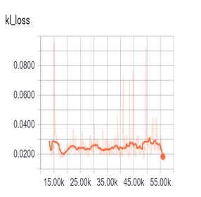
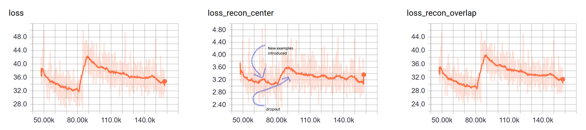
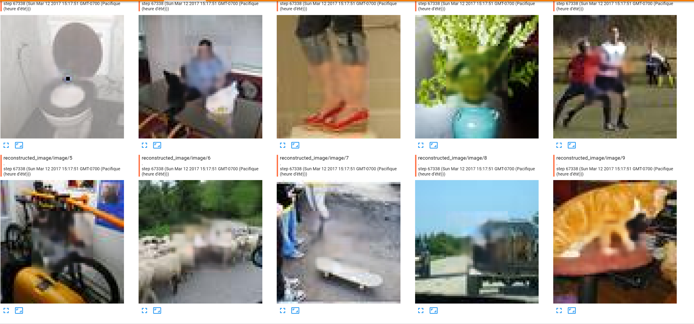
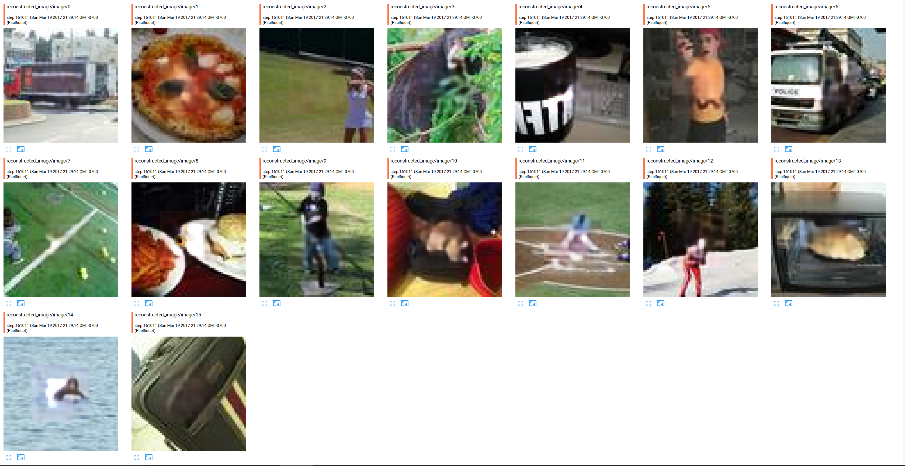
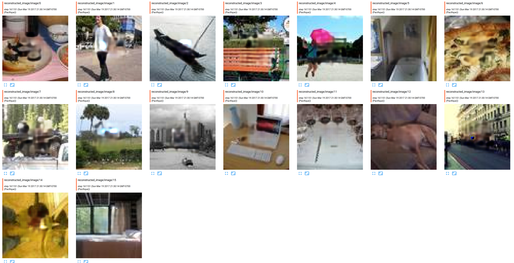
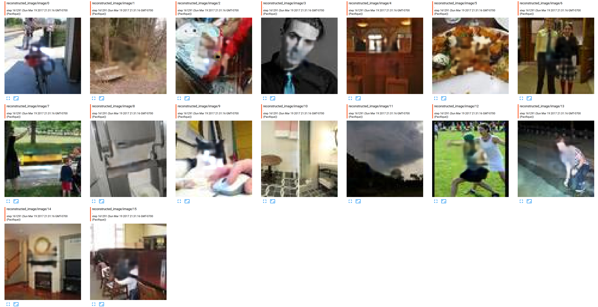
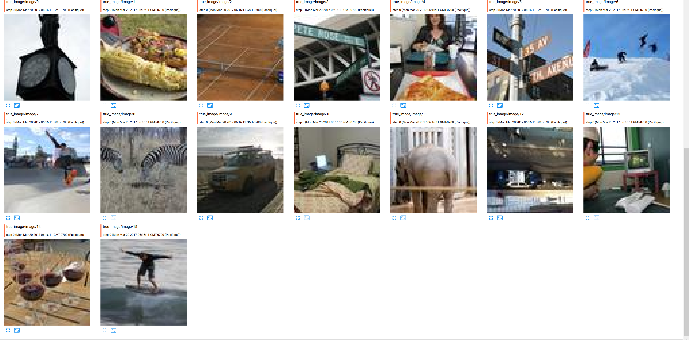

# Captions
There has been some incredible results recently for filling images, but none of them were using captions. This is why I focus mainly on trying to introduce captions in recent similar model. 

I am spending most of my time on this project trying to find a good ways to incorporate the information contained in the caption into the generative model. 

I hesitated between different techniques, but I realised that I firstly need to find good word embedding or train a model based on all captions. 

There are at least 5 captions per images, each caption has ~10 words. It seems like a too small corpus to train the model. 

## Pre-trained Stanford embedding
I've used Stanford trained Glove embedding for a while, so I think it could be a nice idea to re-used them. I look for the proportion of word in the caption vocabulary that have a pre-trained embedding.... only one half. Not enough to capture the meaning of the sentences.  


## FastText
FAIR releases recently pre-trained embedding for different languages. Embedding are trained on all Wikipedia. _Fasttext_ can be a good choice because it works with words that are not in the initial training vocabulary. I've never read the paper of the algorithm (don't read, don't trust), and I've used them for other tasks, but I always found Glove embedding were of better quality, leading better model. Maybe someone could try to used them and see if they perform well.  


## Skip-Thought vectors
Quoted from the abstract of the paper _"We describe an approach for unsupervised learning of a generic, distributed sentence encoder. Using the continuity of text from books, we train an encoder-decoder model that tries to reconstruct the surrounding sentences of an encoded passage. Sentences that share semantic and syntactic properties are thus mapped to similar vector representations"_. It means like a nice approach to try because we have different sentences meaning the same thing, so every caption should be transformed in vector that are closed in the high dimensional space.   
.  
It takes quite a while to create the embedding, and I am still generating some of them.

To assess the quality of the embedding created, I created a little script to plot embedding. I consider only the first $\frac{6000 captions}{5 caption per images}$ images.

### Initial guess
I am hopping that sentences which have relative same meaning, should be closed in space. Because the vector generated is 4800 long, I needed a manifold learning algorithm. In Tensorflow, it is possible to used PCA, or t-SNE to visualize them in 3 dimensions. 
Another way, without plotting them, would be to do a nearest neighbor search. 

Here are some results (code is in _helper\_visualize.py_, make sure you create a metadata.tsv file before containing captions):  
(Notes: Every caption has an embedding, which means that every image appears five times in the plot, I am hopping they are close).
#### Similar captions in PCA

* I was searching for **computer** and pick the first caption _"A cat laying on top of a computer keyboard_. I restrict the point in space to the closest 100 points. It seems that similar caption contains whether a computer, whether a cat, or a keyboard, which are all part of the caption... Good start.


* While training the model for filling holes, I was amazed by how elephants where nicely fit, so I looked at closed captions of _"A herd of elephants standing next to each other"_. The computed nearest neighbors are elephant, giraffe, or zebras and others...


#### Exploring the points with t-SNE
* Picture of people skiing  


* London red bus (or bus in general)  


__Take home message:__
I think embedding trained with the Skip-Though vector model have captured some interesting semantic of the captions but ....

### Are they influencing the model? (80K iteration experiment)
No, not at all. To prove that, I did some experiments. 

I tried three experiments. __This ten images have never been seen by the model__, __I re-run every experiments twice__:
* Replace embedding by random noise (noise is sample from a Gaussian distribution(0; 0.7))


* True sampling from the Gaussian distribution with mean and variance coming from the fully connected.


* Replace averaging embedding by selecting only one embedding


I really wanted to say "Yes embedding makes the difference", but as far as I know, I don't see any differences. And if I see some differences sometimes, I guess it's because I want to see them...  
I have some insights why the model didn't need them, but I am open to discuss this (StackGAN results are very domain specific: drawing birds or flower.).  
  

# Model
## A. Queues and data augmentation
I am using Tensorflow queues, because it is much simpler than feeding a dictionary, way faster, allow me to fastly experimenting new model, and I can make some data augmentation before passing data to the model.  
Right now I am only randomly flipping right or left the images. I am planning to add some techniques explained in this [blog](http://machinelearningmastery.com/image-augmentation-deep-learning-keras/).  
Also, i don't fill the image with black or white color, I am filling every pixel to fill in each channel with the respective average channel color of the cropped image.   
I crop the image in the middle, for simplicity. Some papers claimed it does not harm generalization (but I am not sure if it's more than they were lacking time for experimenting it :) ).

## B. Embedding embedding in the model
tldr: I used a technique I found in the recent StackGan architecture. They advanced some arguments about conditioning a model with high dimensional vectors:
* "However, latent space conditioned on text is usually high dimensional (> 100 dimensions). With limited amount of data,  it usually causes discontinuity in the latent data manifold, which is not desirable for learning the generator."
* "To further enforce the smoothness over the conditioning manifold and avoid overfitting, we add the following regularization term to the objective of the generator during training".. KL divergence. 

After seeing the results from the paper, I was convinced it will help the "generative" model (in the sense of generating images) towards the tasks of filling images.
Here is the plot of the KL loss. During the first iterations, I saw it going down, but afterwards it restart to going up. Note that the large increase of the curve represents the moment when I introduced new examples to the model.
  

Before sampling from a normal distribution, embedding, five in total per images, are averaged. I did this, because based on the previous embedding plots, I think averaging embeddings should give me the a point in the high dimension space which has some notions of the semantic from every captions.  
__Notes__: There are some more advanced technique such as using a recurrent neural network, but in this configuration, i don't think averaging should harm the training model.  

The average of all captions is then passed into a fully connected, which output a mean and (log) variance. Using the reparametrization-trick on a Gaussian(0, 1), it is possible to sample from this conditionned gaussian distribution. The size of the sampled vector is 100. 

## C. Auto-Encoder
### 1. Architecture
I did a pretty deep neural network (~30 layers), but it's basically a encoder-decoder with a lot of residual blocks in the decoder. I didn't use anything special between the encoder and the encoder, some people are using channel wise, I think passing the channel is better. The embedding is stacked on top of convolution channels (4x4x512 + 4x4x100). An embedding is replicated in all 4x4 dimensions. 
Code is in ```model.py```.   
Recently, I also try a deeper model, with more convolution at the end of the reconstruction, but it was a failure. Image generated were blurry. 

#### Side notes on why my first model is performing the best
First model was the best, eventhough it had some flaws in its code.  (For example, all pixels were in [0, 1])  
One reason that could explain how well it performed is because I slowly introduced more and more sample starting with a 5.000 sample, up to 83.000 now.  
Moreover the introduction of dropout in the middle, really helped the model to learn better reconstruction features, which leads better looking alike generated images.  

#### Miscellaneous
<!--  /!-->
* Dropout every three layers
* Batch size is small (gpu is never fully loaded), but I found experimentally helping the optimization process.  
* Batch normalization almost everywhere

### 2. Loss function
Classic L2 loss, but for smoothness in the border, I encourage more pixel at the frontier to be closed to the truth. Seeing the images generated, I saw the difference of this trick: it really remove the effect of a squared block append on top of the image, which is pretty cool.

* Recently, I tried  on a new model without success. I think it is more usefull as a fine-tuning loss functions for an already trained model.

* Need to introduce L1 loss for sparsity.

### 3. Adversarial cost
There are out two papers who claimed to remove the blurriness in generated images.
* One is using neural style transfer, and it takes three minutes to generate a new images. With the recent progress in Neural Style Transfer [google paper](https://arxiv.org/pdf/1610.07629v2.pdf), maybe!  
* The other one, wait for it... is a GAN which try to differentiate between truth generated image and fake ones. The D should have some insights of what is a correct images with wrong captions, so the D should consider truth images, with wrong captions as fake sample. [paper](https://arxiv.org/abs/1604.07379).  
  

I don't have a long experience with GAN's but every time I wanted to train them, I had to stay close my computer, because it is very unstable, and whether the G doesn't learn anything, whether G and D loss keeps oscillating.  
<!--  /!-->  

For this project, I decided to give a shot to the recent WGAN. As far as I understood, the paper claims we can train discriminator to convergence, then train the generator on it. In compensation, gradients of the discriminator need to be clipped to small values...  
* The generator loss become the previous loss defined in 2) + ```tf.reduce_mean(-(features_fake_image + feature_fake_captions)```
* The discriminator loss is ```tf.reduce_mean(features_fake_image + feature_fake_captions - features_real)```. 
As of now, it does not help the model, and I observed that the inside generated images become completely off-context (It fill the images with a squared blurry images which does not have the same color). 
I need to fix it.  

### Regularization
I added dropout as a regularizer in the middle of the training.  

#### Test set images (without dropout iteration=80K, with dropout iteration=140K)
There is no improvement in the quality of generated unseen images.
  
  
  

#### Training set images
However, it helps the model to not overfit on the training set, as you can see on this images. 
Without dropout, it's difficult to see the frontier between the holes fitted and the border, which is not true with dropout.
  
  
  

### Preliminary results 
#### First wave (iteration=140K)
* Loss functions:  
  

* Sample images unseen (always generated then true pictures)
1. First sample
  
  
2. Second sample
  
  
3. Third sample
  
  
4. Fourth sample
  
  

I observed that it's harder for the model to fill images when the background is very blurry in its nature, like vegetation.  

#### Second wave (iteration = 220K)
I aggresively turned on dropout, because it seemed to overfit my training set. The next images come from the training set:


  
and the true image, to see the difference
  

Results on the testing set:
* Generated image: 
  
* True image:
  